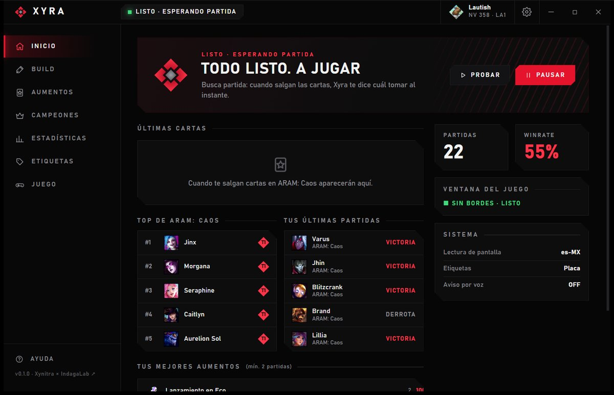
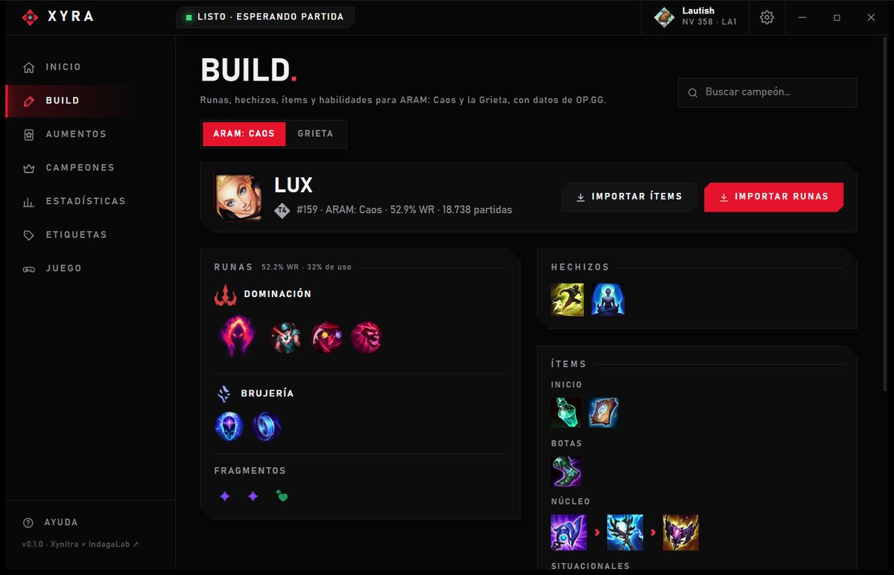
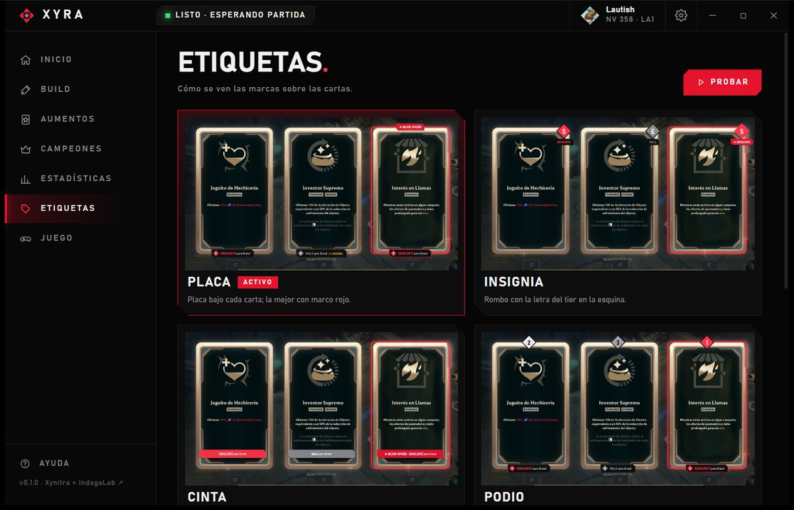
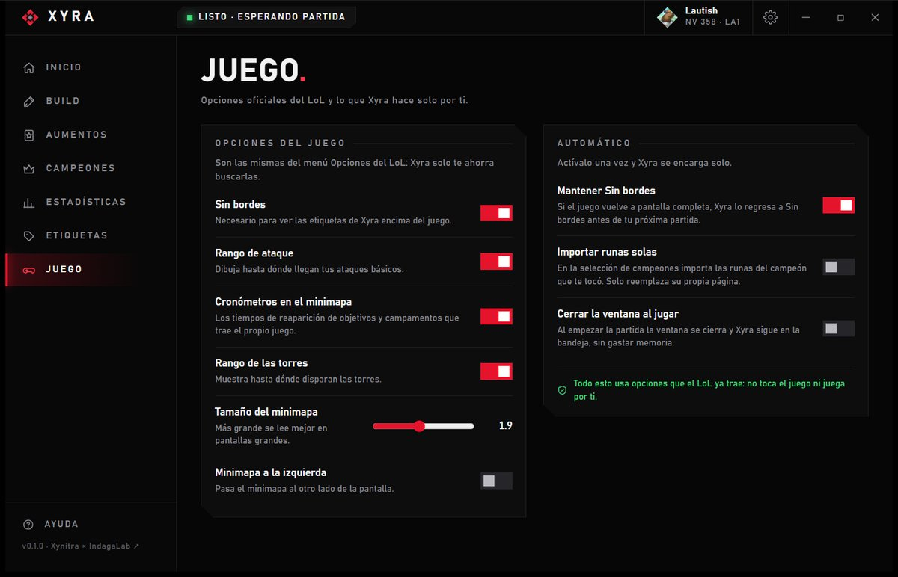
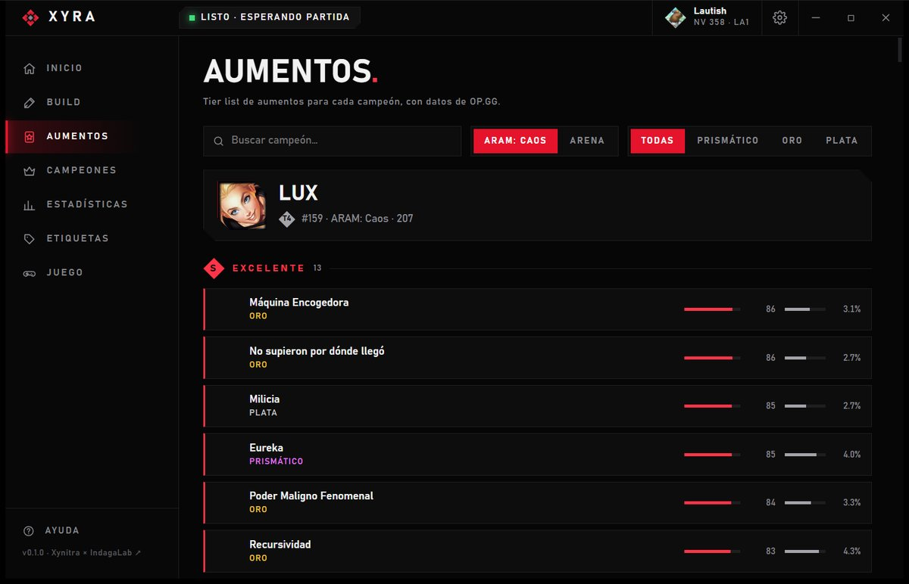

<p align="center"></p>

<p align="center">
  <a href="https://github.com/DiegoFernandoLojanTenesaca/xyra/releases/latest"></a>
  
  <a href="https://github.com/DiegoFernandoLojanTenesaca/xyra/actions/workflows/ci.yml"></a>
  <a href="LICENSE"></a>
</p>

<p align="center"><b>Companion de escritorio para League of Legends.</b> Mira tus cartas de aumento y te marca la mejor para tu
campeón en el momento en que salen, con estadísticas de OP.GG. Además: builds y runas que se importan con un clic, tier
lists y tus estadísticas. Liviano, en español e inglés, y sin tocar el juego.</p>

<p align="center"></p>

*English version below.*

## Así se ve

<table>
  <tr>
    <td width="50%"><br><b>Inicio</b> · qué carta tomar, tu resumen y el top de ARAM: Caos</td>
    <td width="50%"><br><b>Build</b> · runas, hechizos, ítems y habilidades, listos para importar</td>
  </tr>
  <tr>
    <td><br><b>Etiquetas</b> · 5 estilos para las marcas sobre las cartas</td>
    <td><br><b>Juego</b> · opciones oficiales del LoL y automatizaciones</td>
  </tr>
  <tr>
    <td><br><b>Aumentos</b> · tier list por campeón, ARAM: Caos y Arena</td>
    <td><br><b>Estadísticas</b> · tu winrate y tus mejores aumentos</td>
  </tr>
</table>

## Qué hace

- **Etiquetas sobre las cartas** de ARAM: Caos y Arena, en 5 estilos (Placa, Insignia, Cinta, Podio, Enfoque). La mejor
  queda marcada en rojo y las malas te sugieren cambiarlas, en el momento en que salen.
- **Titular directo** en la app: *"Elige ¡Comienza a Emocionarte!"*; en la selección, *"Toma a Jinx de la banca"*.
- **Build** para ARAM: Caos y para la Grieta (normales, por posición): runas, hechizos, ítems y orden de habilidades,
  con botones para importar las runas y el set de ítems a tu cliente.
- **Juego**: activa en un clic opciones oficiales del LoL (rango de ataque, cronómetros del minimapa, rango de torres,
  tamaño del minimapa) y automatiza lo aburrido: mantener Sin bordes, importar runas solas, cerrar la ventana al jugar.
- **Tier lists** de aumentos por campeón y de campeones en ARAM: Caos.
- **Tus estadísticas y tu perfil**: winrate por campeón, mejores aumentos, nivel, rango y maestrías; exportación a CSV.
- **Aviso por voz** opcional, **calibración** para otras resoluciones y modo "guardar capturas" para reportar fallos.
- Vive en la **bandeja del sistema** y solo trabaja durante tus partidas.

### Cómo funciona

| Pieza | Qué hace |
|---|---|
| Lectura de pantalla | Captura solo la zona de las cartas y la lee con el OCR que trae Windows, únicamente con el juego al frente. |
| Capa nativa | Una ventana transparente dibujada con Direct2D, que deja pasar los clics y nunca toma el foco. Sin navegador. |
| Datos | OP.GG (tiers de aumentos, builds), CommunityDragon (íconos) y el cliente del LoL (nombres en tu idioma, historial). |
| Interfaz | Tauri 2 + Svelte 5: la ventana se crea al abrirla y se destruye al cerrarla. |

## Seguridad

No lee la memoria del juego, no le inyecta nada, no simula teclas ni clics y no automatiza nada: solo mira la pantalla y
dibuja encima. Todos los detalles en [SEGURIDAD.md](SEGURIDAD.md).

## Instalación

1. Descarga el instalador `Xyra_x.y.z_x64-setup.exe` desde [Releases](../../releases).
2. Pon el LoL en **Sin bordes** (*Opciones → Video → Modo de ventana*). Xyra te avisa si no lo está y puede cambiarlo
   por ti con el juego cerrado.
3. Juega ARAM: Caos. Xyra arranca con Windows y queda en la bandeja.

Requisitos: Windows 10 u 11 (WebView2 viene incluido en Windows 11) y el reconocimiento de texto de Windows para el idioma
de tu cliente (suele venir con el idioma de Windows).

## Desarrollo

Rust (núcleo, motor y capa nativa con Direct2D) + Tauri 2 y Svelte 5 (ventana principal).

```powershell
pnpm install
pnpm tauri dev              # desarrollo
pnpm tauri build            # instalador en target/release/bundle/nsis
cargo test --workspace      # pruebas; también regenera src/lib/generado
pnpm check                  # tipos de la interfaz
```

`xyra.exe --demo` muestra etiquetas de ejemplo al arrancar, para probar la capa sin jugar.

### Cómo está organizado

Cada cosa se define **una sola vez** y el resto la usa:

| Dónde | Qué es la fuente única de |
|---|---|
| `crates/xyra-core/` | La lógica que no depende de Windows: reconocer y calificar cartas, OP.GG, cliente del LoL, estadísticas, perfil, ajustes. Sin interfaz, con pruebas; se puede reutilizar (p. ej. en un compañero para el celular). |
| `crates/xyra-core/src/modelo.rs` | Los datos que ven las interfaces. `cargo test` los exporta a TypeScript en `src/lib/generado/` (ts-rs): Rust y la interfaz nunca se desalinean. |
| `src-tauri/` | La app de Windows: motor (`motor.rs`), captura y OCR (`pantalla.rs`), capa nativa (`capa.rs`), voz, bandeja y comandos. |
| `src/lib/tema.css` | Colores, tipografía y piezas visuales (paneles, botones, esquinas cortadas). Las páginas no definen colores. |
| `src/lib/app.svelte.ts` | El estado de la interfaz (lo que manda el motor, la navegación) y las acciones. Las páginas lo importan. |
| `src/lib/i18n.ts` | Todos los textos, en español e inglés. |
| `src/lib/ui/` | Componentes reutilizables: encabezado, cifras, tiers, interruptores, buscador, pestañas. |
| `src/lib/paginas/` | Las páginas: solo acomodan piezas de lo anterior. |

## Creadores

| | | |
|---|---|---|
|  | **Diego Fernando** · [@DiegoFernandoLojanTenesaca](https://github.com/DiegoFernandoLojanTenesaca) | Creador · **IndagaLab** |
|  | **[@jahirxtrap](https://github.com/jahirxtrap)** | Cocreador · **Xynitra** |

Gracias a OP.GG por las estadísticas y a CommunityDragon por los íconos.

## Aviso

Proyecto de la comunidad. Xyra no está respaldado por Riot Games ni refleja sus opiniones; League of Legends es marca de
Riot Games, Inc. Sin relación con OP.GG. Úsalo bajo tu responsabilidad.

---

## English

**Xyra** labels **ARAM: Mayhem** and **Arena** augment cards with how good each one is **for your champion**, using
OP.GG stats. The best card is highlighted and bad ones suggest a reroll. Lightweight, Windows-only, Spanish/English.
By **Diego Fernando** (IndagaLab) and **@jahirxtrap** (Xynitra).

- 5 label styles, champion select tiers, builds with rune and item set import, augment and champion tier lists, optional voice hint, personal stats and
  profile, CSV export, Arena (beta), calibration for other resolutions.
- Screen reading + a native click-through overlay only: no memory access, no injection, no simulated input
  ([SEGURIDAD.md](SEGURIDAD.md)).
- Install from [Releases](../../releases), set League to **Borderless**, play.

Xyra isn't endorsed by Riot Games and doesn't reflect the views or opinions of Riot Games. MIT License.
