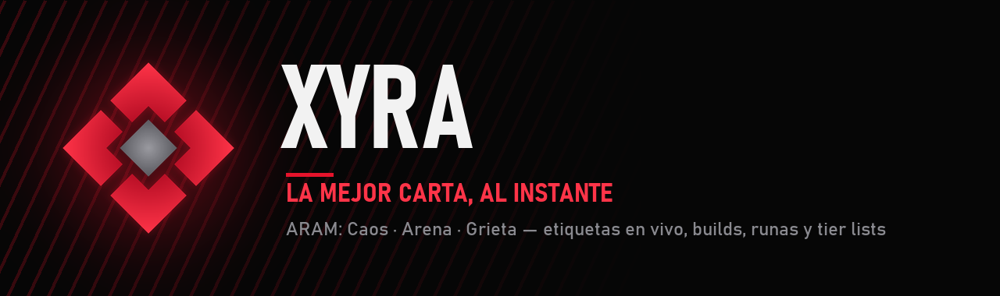
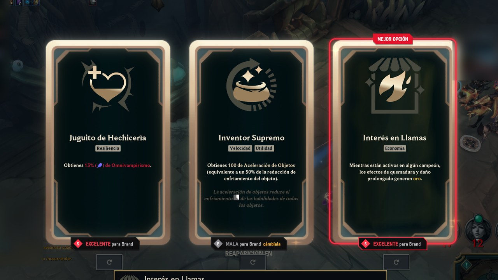
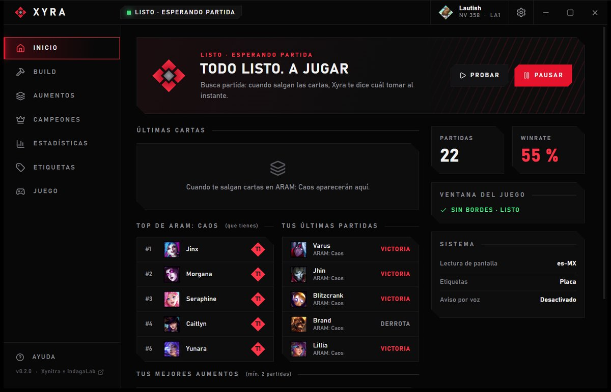
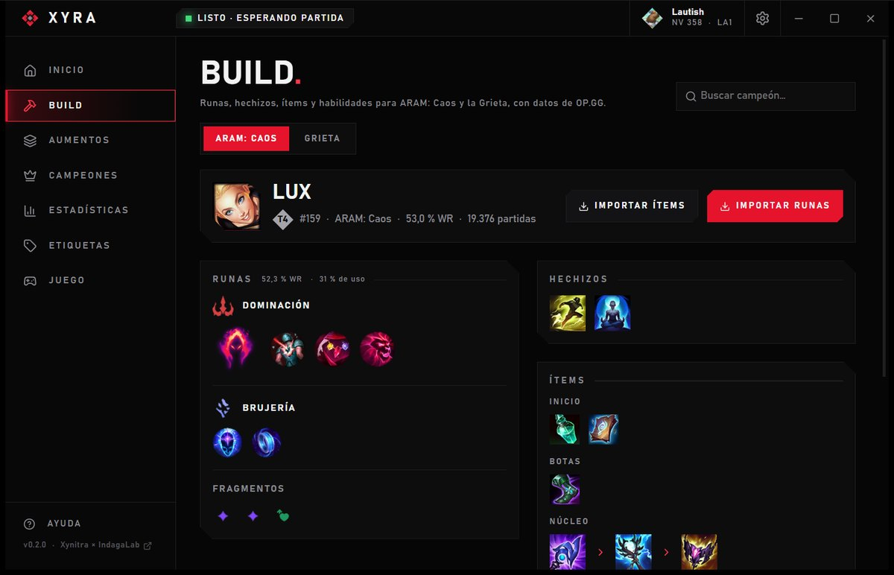
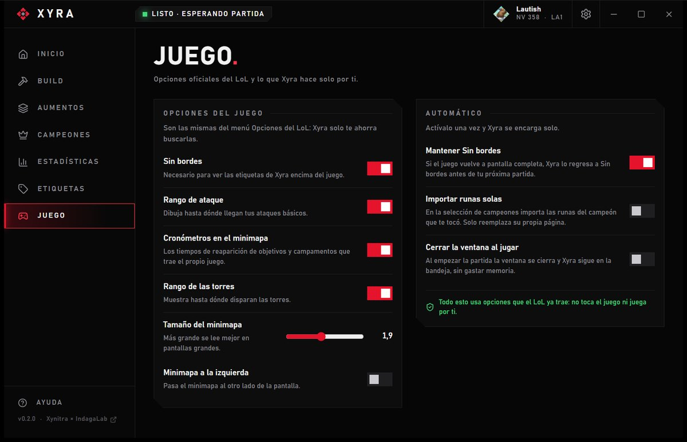
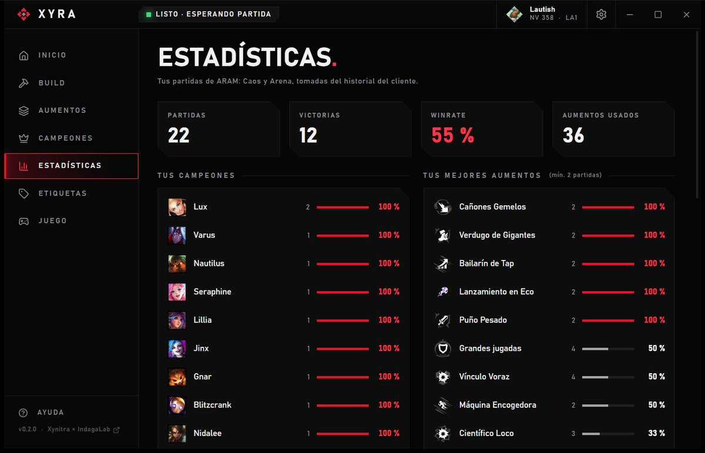

  
  
  
  

<b>Companion de escritorio para League of Legends.</b> Mira tus cartas de aumento y te marca la mejor para tu
campeón en el momento en que salen, con estadísticas de OP.GG. Además: builds y runas que se importan con un clic,
counters para la Grieta, tier lists y tus estadísticas. Liviano, en español e inglés, y sin tocar el juego.

*English version below.*

## Así se ve

<table>
  <tr>
    <td width="50%"> <b>Inicio:</b> qué carta tomar, tu resumen y el top de ARAM: Caos</td>
    <td width="50%"> <b>Build:</b> runas, hechizos, ítems y habilidades, listos para importar</td>
  </tr>
  <tr>
    <td> <b>Etiquetas:</b> 5 estilos para las marcas sobre las cartas</td>
    <td> <b>Juego:</b> opciones oficiales del LoL y automatizaciones</td>
  </tr>
  <tr>
    <td> <b>Aumentos:</b> tier list por campeón, ARAM: Caos y Arena</td>
    <td> <b>Estadísticas:</b> tu winrate y tus mejores aumentos</td>
  </tr>
</table>

## Qué hace

- **Etiquetas sobre las cartas:** en ARAM: Caos y Arena, en 5 estilos (Placa, Insignia, Cinta, Podio, Enfoque). La mejor
  queda marcada en rojo y las malas te sugieren cambiarlas, en el momento en que salen.
- **Titular directo:** "Elige ¡Comienza a Emocionarte!" en partida; en la selección, "Toma a Jinx de la banca" o, en la
  Grieta, "Contra Yasuo, toma a Malzahar".
- **Solo campeones que puedes jugar:** las recomendaciones (banca, top y counters) saltan los que tu cuenta no tiene ni
  están gratis.
- **Build:** runas, hechizos, ítems y orden de habilidades para ARAM: Caos y para la Grieta (normales, por posición), con
  enfrentamientos (a quién le gana y contra quién le cuesta) y botones para importar las runas y el set de ítems a tu
  cliente.
- **Juego:** activa en un clic opciones oficiales del LoL (rango de ataque, cronómetros del minimapa, rango de torres,
  tamaño del minimapa) y automatiza lo aburrido (mantener Sin bordes, importar runas solas, cerrar la ventana al jugar).
- **Tier lists:** aumentos por campeón y campeones de ARAM: Caos.
- **Tus datos:** winrate por campeón, mejores aumentos, nivel, rango y maestrías, separados por cuenta; exportación a CSV.
- **Extras:** aviso por voz, calibración para otras resoluciones y capturas para reportar fallos.
- **Liviano:** vive en la bandeja del sistema y solo trabaja durante tus partidas.

## Cómo funciona

Escucha al cliente del LoL por su WebSocket (con el certificado de Riot verificado) => sabe al instante si estás en la
selección o en partida y con qué campeón => durante la partida lee la zona de las cartas con el OCR que trae Windows (solo
con el juego al frente) => las califica con OP.GG => dibuja las etiquetas en una capa nativa de Direct2D que deja pasar
los clics y nunca toma el foco. Sin navegador mientras juegas.

## Seguridad

No lee la memoria del juego, no le inyecta nada, no simula teclas ni clics y no juega por ti: solo mira la pantalla y
dibuja encima. Todos los detalles en [SECURITY.md](SECURITY.md).

## Instalación

1. Descarga `Xyra_x.y.z_x64-setup.exe` desde [Releases](../../releases).
2. Pon el LoL en **Sin bordes** (Opciones => Video => Modo de ventana). Xyra lo hace por ti con el juego cerrado.
3. Juega ARAM: Caos. Xyra arranca con Windows y queda en la bandeja.

Requisitos: Windows 10 u 11 y el reconocimiento de texto de Windows para el idioma de tu cliente (suele venir con el
idioma de Windows).

## Creadores

| | | |
|---|---|---|
|  | **[@DiegoFernandoLojanTenesaca](https://github.com/DiegoFernandoLojanTenesaca):** creador | IndagaLab |
|  | **[@jahirxtrap](https://github.com/jahirxtrap):** cocreador | Xynitra |

Gracias a OP.GG por las estadísticas y a CommunityDragon por los íconos. Para contribuir, mira [CLAUDE.md](CLAUDE.md).

## Aviso

Proyecto de la comunidad. Xyra no está respaldado por Riot Games ni refleja sus opiniones; League of Legends es marca de
Riot Games, Inc. Sin relación con OP.GG. Úsalo bajo tu responsabilidad.

---

## English

**Xyra** labels **ARAM: Mayhem** and **Arena** augment cards with how good each one is **for your champion**, using OP.GG
stats. The best card is highlighted and bad ones suggest a reroll. Lightweight, Windows only, Spanish and English. By
**@DiegoFernandoLojanTenesaca** (IndagaLab) and **@jahirxtrap** (Xynitra).

- **Labels:** 5 styles, shown the moment the cards appear.
- **Build:** runes, spells, items, skills and matchups for ARAM: Mayhem and Summoner's Rift, with rune and item set import.
- **Counters:** in Summoner's Rift champion select, the champions you own that beat your lane opponent.
- **Game:** official League options in one click, plus automations.
- **Safe:** screen reading and a native click-through overlay only; no memory access, no injection, no simulated input
  ([SECURITY.md](SECURITY.md)).

Install from [Releases](../../releases), set League to **Borderless** and play. Xyra isn't endorsed by Riot Games and
doesn't reflect the views or opinions of Riot Games. MIT License.