
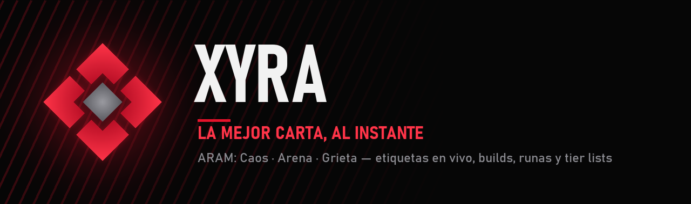

  
  
  
  
  

<b>Companion de League of Legends para todos los modos.</b> Al elegir campeón te pone runas, hechizos e
ítems de OP.GG, te dice a quién tomar de la banca o contra quién, te marca los buffs y nerfs del parche y, en ARAM: Caos y
Arena, la mejor carta de aumento en el momento en que sale. Con app para Android que te avisa cuando encuentras partida.
Liviano, en español e inglés, y sin tocar el juego.

  <a href="https://github.com/DiegoFernandoLojanTenesaca/xyra/releases/latest"><b>Descargar para Windows</b></a> ·
  <a href="https://github.com/DiegoFernandoLojanTenesaca/xyra/releases/latest"><b>Descargar la app para Android</b></a> ·
  <a href="https://xyra-app.pages.dev/"><b>Sitio web</b></a>

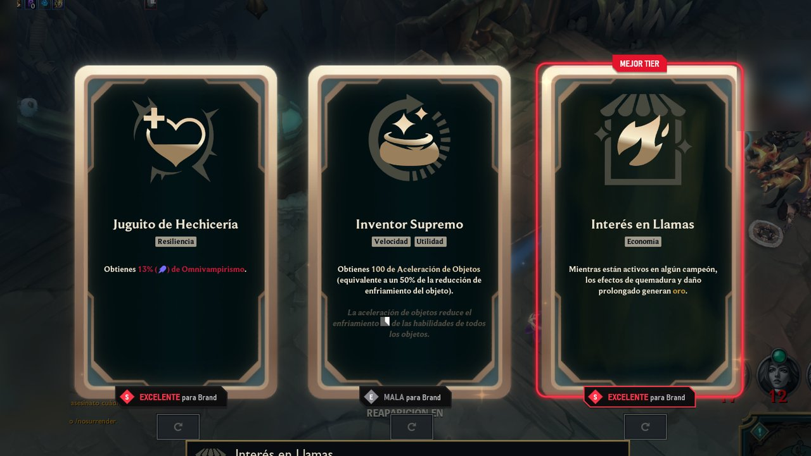

*English version below.*

## Novedades

**0.9.0**

- **Sala:** crea una sala, invita a tus amigos conectados y busca partida desde la PC o el celular.
- Tu KDA, farm, oro y nivel en vivo mientras juegas, también en el celular.
- **Siguiendo a Xyra:** cómo te va cuando tomas la carta recomendada y cuando no.
- El celular te avisa cuando tu partida empieza a cargar y cuando sale un parche con cambios a tus campeones.
- Tus partidas con cada campeón en Build y los hechizos que usaste en el Historial.

**0.8.0:** aviso de nueva versión en la PC y el celular. **0.7.0:** tus opciones de la banca en la selección.
**0.6.0:** aviso de partida en el celular con el sonido del LoL. Todas las notas en [Releases](../../releases). Las
versiones siguen el [versionado semántico](https://semver.org/lang/es/): el tercer número sube con arreglos, el segundo
con funciones nuevas y la 1.0.0 será la primera versión estable.

## Así se ve

<table>
  <tr>
    <td width="50%">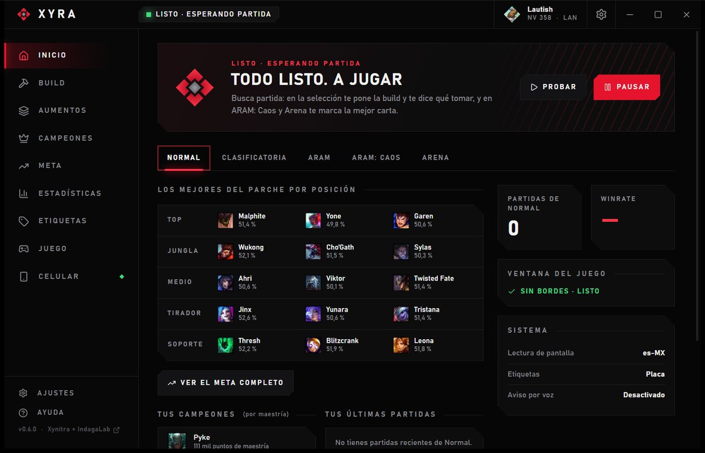 <b>Inicio:</b> cada modo con lo suyo, de Normal a Arena</td>
    <td width="50%"> <b>Meta:</b> buffs y nerfs del parche y los mejores de cada modo</td>
  </tr>
  <tr>
    <td>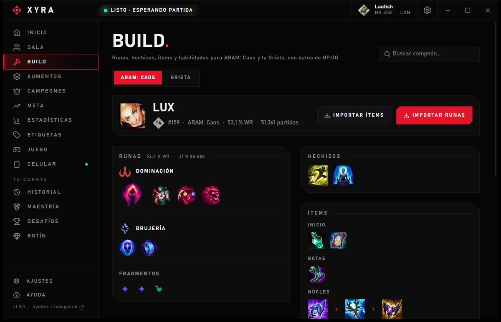 <b>Build:</b> runas, hechizos, ítems y habilidades, listos para importar</td>
    <td>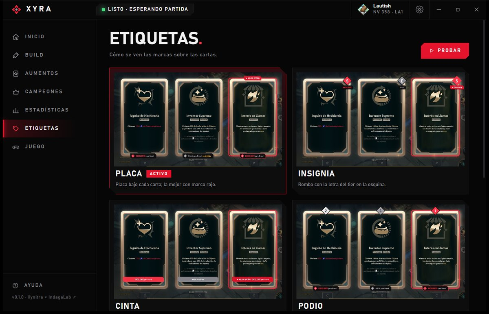 <b>Etiquetas:</b> 5 estilos para las marcas sobre las cartas</td>
  </tr>
  <tr>
    <td>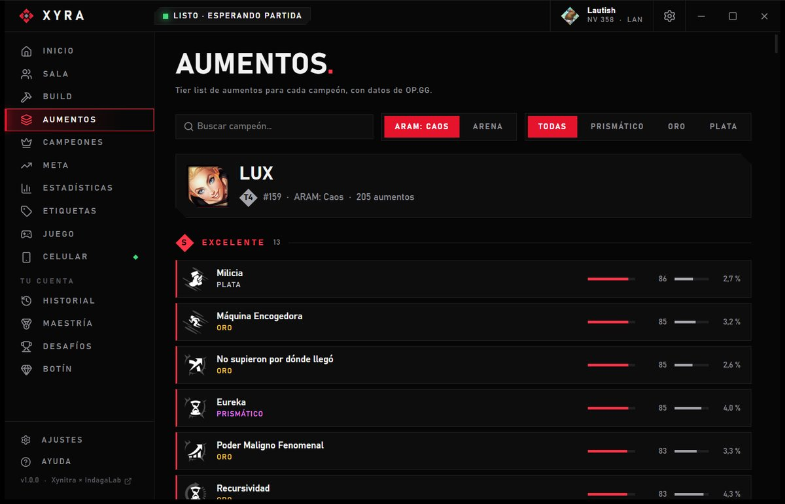 <b>Aumentos:</b> tier list por campeón, ARAM: Caos y Arena</td>
    <td>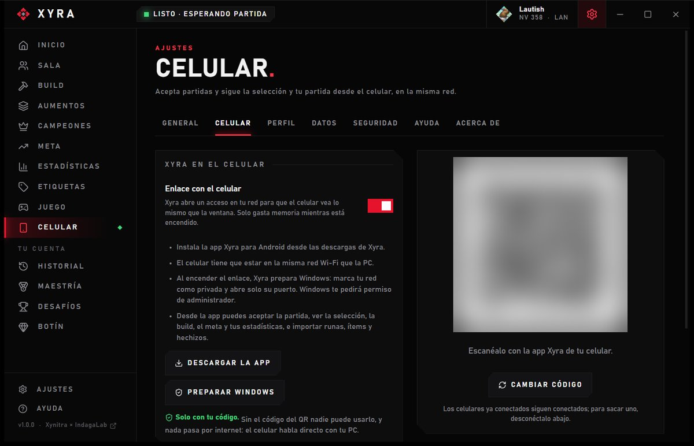 <b>Celular:</b> el código para emparejar y los celulares conectados</td>
  </tr>
  <tr>
    <td>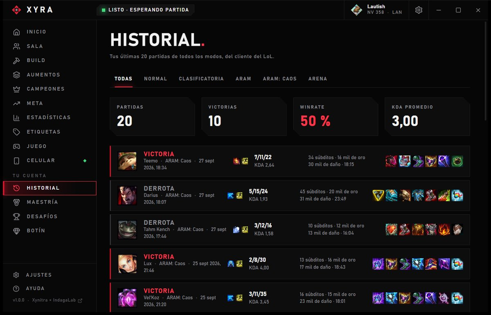 <b>Historial:</b> tus partidas de todos los modos con KDA e ítems</td>
    <td> <b>Maestría:</b> cuánto te falta para subir cada campeón</td>
  </tr>
  <tr>
    <td>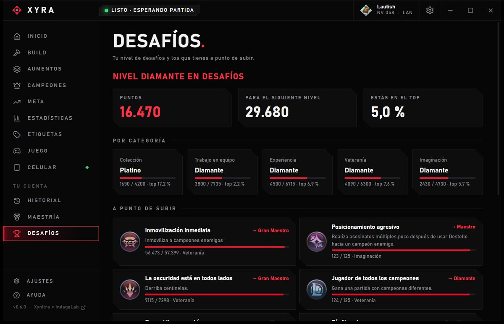 <b>Desafíos:</b> tu nivel y los que tienes a punto de subir</td>
    <td>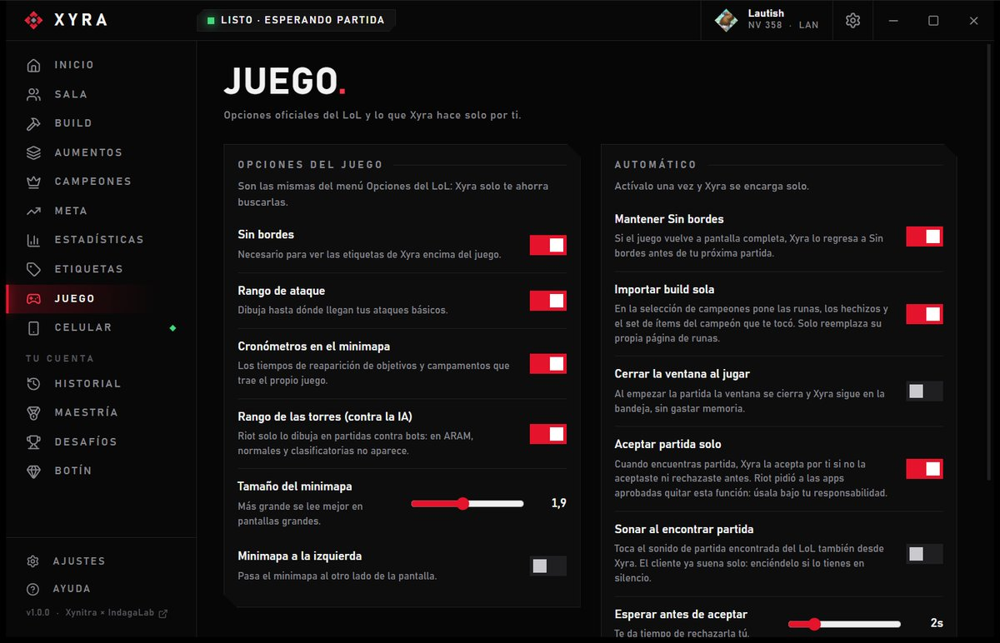 <b>Juego:</b> opciones oficiales del LoL y automatizaciones</td>
  </tr>
  <tr>
    <td>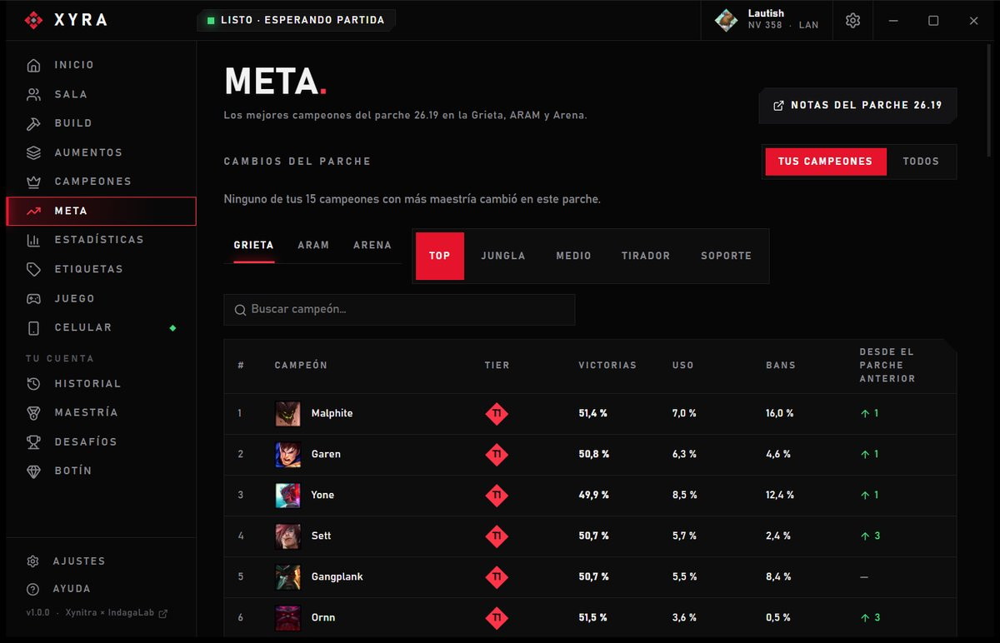 <b>Estadísticas:</b> tu winrate, tus mejores aumentos y si sigues a Xyra</td>
    <td>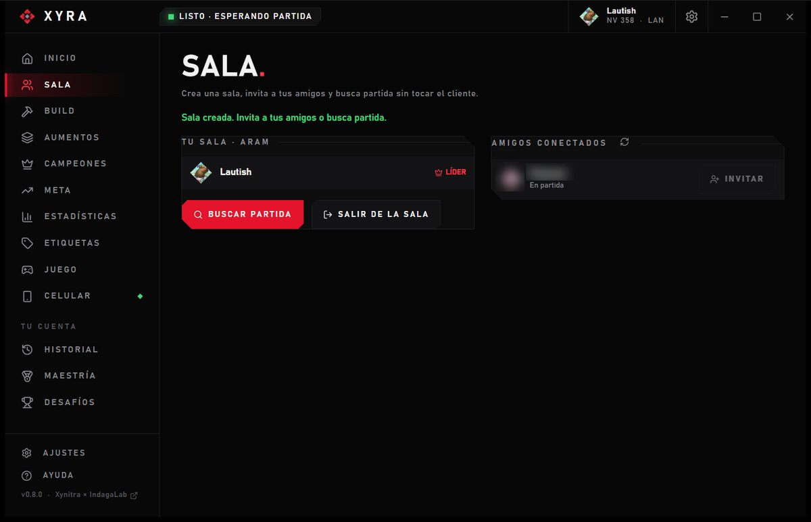 <b>Sala:</b> crea la sala, invita a tus amigos y busca partida</td>
  </tr>
</table>

## Xyra en tu celular

Empareja la app para Android con el QR de Ajustes → Celular y usa Xyra desde el sofá: te avisa cuando encuentras partida
(aunque la app esté cerrada), aceptas desde el aviso, sigues la selección, importas la build, tomas de la banca y ves el
meta, tus datos y los consejos en partida. Todo por tu Wi-Fi, sin pasar por internet.

<table>
  <tr>
    <td width="33%">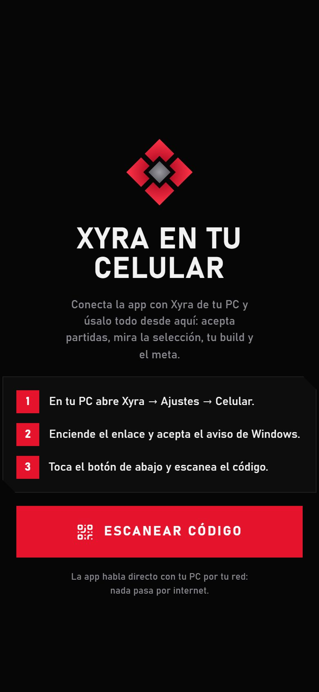 <b>Conecta con un QR</b></td>
    <td width="33%">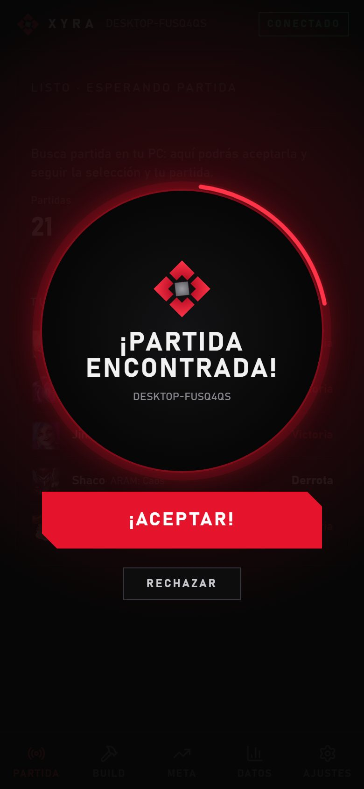 <b>¡Partida encontrada!</b></td>
    <td width="33%">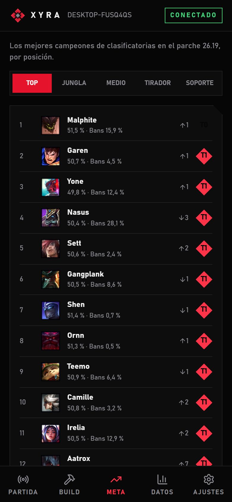 <b>Buffs, nerfs y meta</b></td>
  </tr>
  <tr>
    <td>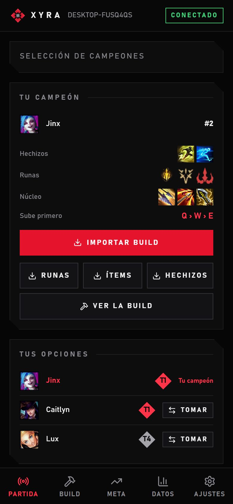 <b>Tu build en la selección</b></td>
    <td>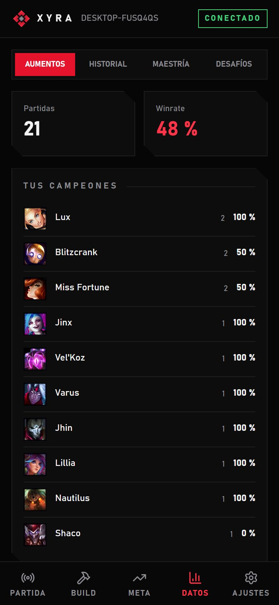 <b>Tus datos</b></td>
    <td>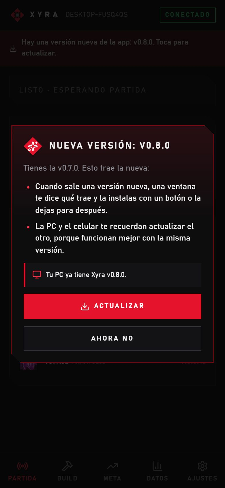 <b>Siempre al día</b></td>
  </tr>
</table>

**Descárgala:** `xyra-android-x.y.z.apk` en la [última versión](../../releases/latest) (Android 7 o superior). Después
se actualiza sola desde sus Ajustes.

## Qué hace

- **Inicio por modos:** Normal, Clasificatoria, ARAM, ARAM: Caos y Arena, cada uno con lo suyo: los mejores del parche
  por posición, tu rango, las tier lists de ARAM y Arena, tus campeones y tus últimas partidas de ese modo.
- **Build:** runas, hechizos, ítems y orden de habilidades para ARAM y la Grieta (por posición), con enfrentamientos y
  botones para importarlos; si quieres, se ponen solos al elegir campeón.
- **Selección:** en ARAM, tus opciones (tu campeón y la banca, la mejor primero) con un botón para tomar cualquiera y
  todos los demás debajo; en la Grieta, todos los de tu posición y "Contra Yasuo, toma a Malzahar". Solo te recomienda
  campeones que tienes o están gratis, ordenados por tier, maestría o lo que más juegas.
- **Meta y parche:** los mejores de la Grieta, ARAM y Arena, y los buffs y nerfs del parche con el motivo de Riot,
  empezando por tus 15 campeones con más maestría.
- **Etiquetas sobre las cartas:** en ARAM: Caos y Arena, en 5 estilos. La mejor queda marcada en rojo y las malas te
  sugieren cambiarlas, en el momento en que salen.
- **Consejos en partida:** qué habilidad subir y tu siguiente ítem, con el oro que te falta, desde la API oficial del juego.
- **Juego:** opciones oficiales del LoL en un clic y lo aburrido en automático: Sin bordes, aceptar la partida, importar
  la build.
- **Xyra para Android:** aviso de partida con la app cerrada, aceptar, selección, build, meta y ajustes desde el
  celular; cada celular con su propia llave y sus permisos, y se desconecta desde la PC.
- **Sala:** crea una sala para cualquier modo, invita a tus amigos conectados y busca partida sin tocar el cliente,
  también desde el celular.
- **Tu cuenta:** historial de tus últimas partidas de todos los modos (KDA, oro, daño, hechizos e ítems), la
  maestría de cada campeón con lo que falta para subir y tus desafíos, con los que tienes a punto de subir.
- **Tus datos:** winrate por campeón, mejores aumentos, nivel, rango y maestrías, separados por cuenta; exportación a CSV.
- **Liviano y al día:** vive en la bandeja del sistema, solo trabaja durante tus partidas y se actualiza con un botón.

## Cómo funciona

Escucha al cliente del LoL por su WebSocket (con el certificado de Riot verificado) => sabe al instante si estás en la
selección o en partida y con qué campeón => durante la partida lee la zona de las cartas con el OCR que trae Windows (solo
con el juego al frente) => las califica con OP.GG => dibuja las etiquetas en una capa nativa de Direct2D que deja pasar
los clics y nunca toma el foco. Sin navegador mientras juegas.

## Seguridad

No lee la memoria del juego, no le inyecta nada, no simula teclas ni clics y no juega por ti: solo mira la pantalla y
dibuja encima, y usa las APIs oficiales del cliente para lo que harías tú con un clic. Todos los detalles en
[SECURITY.md](SECURITY.md).

## Instalación

1. Descarga `xyra-x.y.z.exe` desde [Releases](../../releases/latest) e instálalo.
2. Pon el LoL en **Sin bordes** (Opciones => Video => Modo de ventana). Xyra lo hace por ti con el juego cerrado.
3. Juega. Xyra arranca con Windows y queda en la bandeja.

Requisitos: Windows 10 u 11 y el reconocimiento de texto de Windows para el idioma de tu cliente (suele venir con el
idioma de Windows).

**En el celular:** instala `xyra-android-x.y.z.apk`, enciende el enlace en Ajustes → Celular de tu PC, acepta el aviso
de Windows y escanea el código con la app.

## Preguntas frecuentes

<b>¿Me pueden banear por usarlo?</b>

Xyra solo mira la pantalla y dibuja encima, como OBS o Discord, y usa las APIs oficiales del cliente para importar la
build, aceptar la partida o cambiar de la banca, lo mismo que harías tú. No lee la memoria del juego ni juega por ti.

<b>¿El celular me avisa de la partida con la app cerrada?</b>

Sí. Con "Avisarme de la partida" encendido en los ajustes de la app, suena y puedes aceptar desde el aviso. Mientras
espera verás una notificación fija de Xyra.

<b>Estoy en el mismo Wi-Fi y el celular no conecta</b>

Algunos módems no dejan pasar al celular hasta que la PC habla en la red. Xyra se presenta solo mientras el enlace
está encendido: deja Xyra abierto en la PC unos segundos y el celular vuelve a intentar solo. La app te muestra qué
revisar.

<b>¿De dónde salen los buffs y nerfs?</b>

De las notas oficiales del parche. Xyra compara los números de cada cambio para marcarlo como buff, nerf o ajuste.

<b>¿Cómo se actualiza?</b>

Xyra te avisa y se actualiza con un botón, sin desinstalar ni perder tus datos. La app del celular, desde sus Ajustes.

<b>¿Hay app para iPhone?</b>

Por ahora solo para Android 7 o superior.

## Creadores

| | | |
|---|---|---|
|  | **[@DiegoFernandoLojanTenesaca](https://github.com/DiegoFernandoLojanTenesaca):** creador | IndagaLab |
|  | **[@jahirxtrap](https://github.com/jahirxtrap):** cocreador | Xynitra |

Gracias a OP.GG por las estadísticas y a CommunityDragon por los íconos. Para contribuir, mira [CLAUDE.md](CLAUDE.md).

## Aviso

Proyecto de la comunidad. Xyra no está respaldado por Riot Games ni refleja sus opiniones; League of Legends es marca de
Riot Games, Inc., igual que el sonido de partida encontrada que usa Xyra. Sin relación con OP.GG. Úsalo bajo tu
responsabilidad.

---

## English

**Xyra** is a League of Legends companion for every mode. It sets your runes, spells and items from OP.GG when you pick
a champion, tells you who to take from the bench or who counters your lane opponent, marks the patch buffs and nerfs,
and labels **ARAM: Mayhem** and **Arena** augment cards with how good each one is for your champion. Its Android app
lets you know when you find a match, even with the app closed. Lightweight, Spanish and English. By
**@DiegoFernandoLojanTenesaca** (IndagaLab) and **@jahirxtrap** (Xynitra).

- **Home by mode:** Normal, Ranked, ARAM, ARAM: Mayhem and Arena, each with its best champions, tier lists and your recent games.
- **Build:** runes, spells, items, skills and matchups for ARAM and Summoner's Rift, imported by hand or automatically.
- **Champion select:** in ARAM, your options from the bench, best first, with a button to take any of them and every
  other champion below; in Summoner's Rift, every champion of your position and counters.
- **Meta and patch:** Summoner's Rift, ARAM and Arena tier lists, and the patch buffs and nerfs from the official notes.
- **Lobby:** open a lobby for any mode, invite your friends online and look for a match without touching the client,
  from the phone too.
- **Your account:** match history of every mode, champion mastery progress and challenges about to level up.
- **Phone app:** match notification with the app closed, accept, builds, meta and settings over your own network.
- **Safe:** screen reading, a native click-through overlay and the client's official APIs only; no memory access, no
  injection, no simulated input ([SECURITY.md](SECURITY.md)).

Install `xyra-x.y.z.exe` from [Releases](../../releases/latest), set League to **Borderless** and play; the phone app is
`xyra-android-x.y.z.apk`. Xyra isn't endorsed by Riot Games and doesn't reflect the views or opinions of Riot Games.
MIT License.
